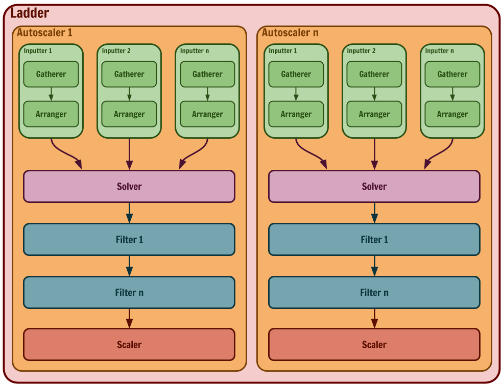
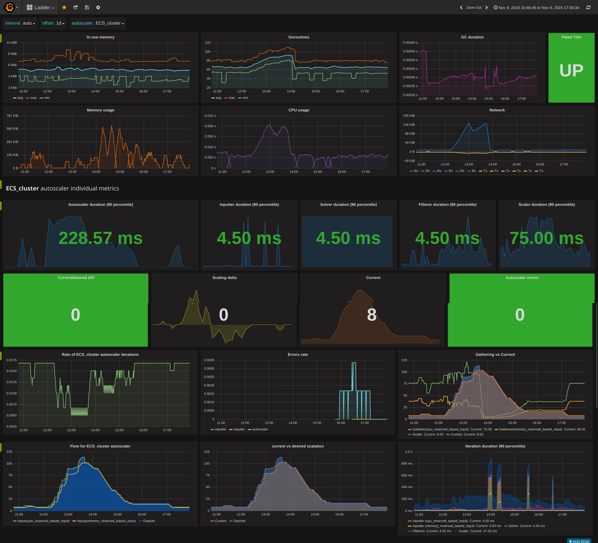

# Ladder [](https://travis-ci.org/themotion/ladder)

Ladder is a simple and flexible general purpose autoscaler.

The idea behind Ladder is to autoscale anything configuring and combining reusable [blocks](https://themotion.github.io/ladder/concepts/blocks/) 
of different types in a yaml file. These blocks are flexible and easy to extend, so anyone can use or develop any kind of scaling targets, 
policies or inputs.

Some examples that Ladder can do at this moment:

* Get number of messages in a [SQS queue](https://aws.amazon.com/sqs/), apply a constant factor to this input, then use this quantity to upscale or downscale the [EC2 machines](http://docs.aws.amazon.com/AWSEC2/latest/UserGuide/Instances.html) of an [AWS AutoscalingGroup](http://docs.aws.amazon.com/autoscaling/latest/userguide/AutoScalingGroup.html)
* Get the latency of a service from a [Prometheus](https://prometheus.io/) metric, is this latency is greater than 800ms, add one more instance to the actual number of instances of that service running on [ECS](https://aws.amazon.com/ecs/),
if is less than 200ms remove one instance to the running ones instead.

We want to add more blocks to the ones that Ladder provides by default (ECS & EC2 ASG), for example:

* Intpus:
    * Get metrics from Datadog
    * Get number of messages from Rabbitmq queue
* Filters:
    * Apply statistic prediction based on a metric, previous autoscaling result, etc
* Scalers:
    * Kubernetes replicas
    * Instance VMs on  GCE
    * Azure virtual machines

## Features

* Very flexible and configurable
* Simple, light and fast
* Reliable
* Easy to configure and extend
* Metrics ready (Prometheus)
* Easy to deploy and set up running
* Tons of third party blocks ready to use (AWS, Prometheus...)

## Architecture




* Inputter: Gets data and returns an scaling quantity result
    * [Gatherer](https://themotion.github.io/ladder/blocks/gatherers/): Gets the data from any resource
    * [Arranger](https://themotion.github.io/ladder/blocks/arrangers/): Applies logic to convert the input to an scaling quantity result
* [Solver](https://themotion.github.io/ladder/blocks/solvers/): Takes one of the multiple results the inputters return.
* [Filter](https://themotion.github.io/ladder/blocks/filters/): Applies logic and changes(or not) the result of the Solver
* [Scaler](https://themotion.github.io/ladder/blocks/scalers/): Scales on a target the desired quantity received from the last filter applied, or from the solver if no filters where applied.


## Status

Ladder has been autoscaling TheMotion platform in production for more than 6 months. We need to finish
the documentantion like a quickstart or a tutorial, make the official Docker images and set a list of
supported providers (at this moment EC2 & ECS only) among other things.

## Documentation

Check out the online documentation at https://themotion.github.io/ladder or offline:

```bash
$ make serve_docs
```

Go to http://127.0.0.1:1313 on the browser

## Prometheus metrics



## Changelog

See [changelog](CHANGELOG.md)

## License

See [license](LICENSE)


## Authors

See [authors](AUTHORS) & [contributors](CONTRIBUTORS)

## Maintainers
See [maintainers](MAINTAINERS.md) to know who is/are the person/people you need to contact.